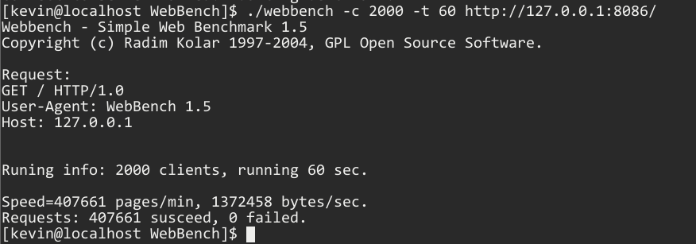
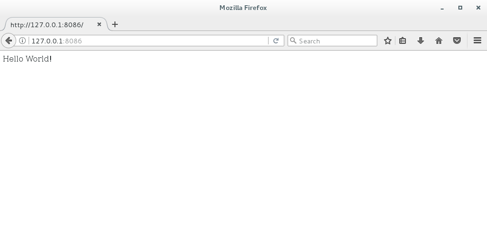
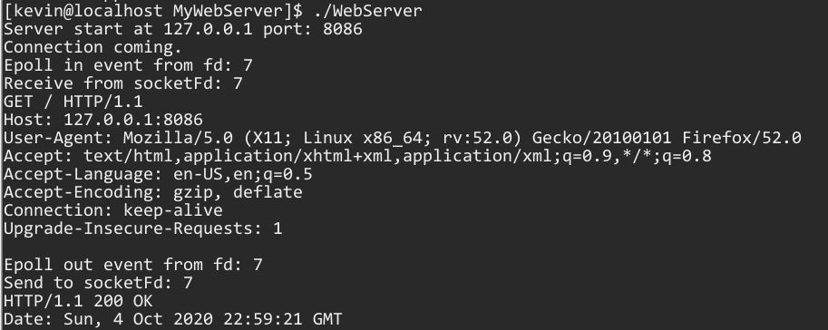

MiniWebServer
===============
学习服务器开发的小项目，参考TinyWebServer（https://github.com/qinguoyi/TinyWebServer）

使用cmake编译，默认8086端口运行。

Usage: ./WebServer

#### 已实现

* 使用epoll ET、oneshot触发
* Reactor模式，主线程监听listenfd、epollfd，分发任务，线程池处理任务
* TimeList维护连接过期时间，使用alarm定时删除过期连接
* 使用锁、管道处理可能的race condition

#### TODO

* HTTP报文处理（当前接收到\r\n\r\n认为请求接收完毕，直接返回默认页面）
* 添加数据库连接、Cookie支持、支持HTTPS

#### 压力测试

使用TinyWebServer项目的webbench进行压测（运行环境CentOS 7.3，i5 4210U）

- 压力测试

 

- 浏览器访问

 

- 运行

 
